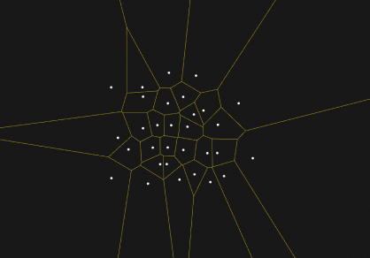
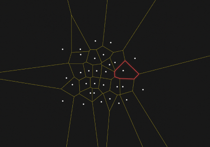
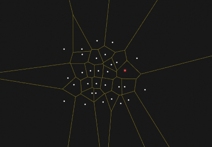
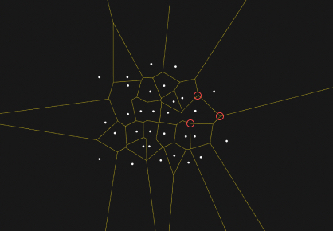

_Алгоритм Форчуна_  
_Реализовал студент Дывак М.В._  
_Дальневосточный Федеральный Университет_  
_Б9121-09.03.03пикд_  
_2023_

# Содержание
* Содержание
* Глоссарий
* Введение
    * Проблема
    * Мотивация использовать
* Описание алгоритма
* Теория
    * Заметающая прямая
    * Локус
    * Сайт
    * Свойство диаграммы Вороного
* Реализации
    * Наивная реализация O(n⁴)
    * Реализация путём пересечения полуплоскостей O(n²•log(n))
* История
* Применение
    * В программировании, разработке игр и картографии
    * В архитектуре и дизайне
    * В археологии
    * В моделировании и распознавании
    * В биологии и химии
* Анализ алгоритма
    * Результаты исследования на память
    * Результаты исследования на время
* Заключение
* Список литературы

# Глоссарий
>- Вершины диаграммы Вороного — вершины многоугольников, ограничивающих локусы.
>- Выпуклый многоугольник — это многоугольник, у которого продолжения сторон не пересекают других его сторон.
>- Диаграмма Вороного – множество точек на плоскости, которые разбивают эту плоскость, на которой каждая область этого разбиения образует множество точек, более близких к одному из элементов множества, чем к любому другому элементу множества. Именно из выпуклых многоугольников состоит диаграмма.
>- Евклидово пространство — это пространство, свойства которого описываются аксиомами евклидовой геометрии.
>- Локус — область, в которой присутствуют все точки, которые находятся ближе к данной точке, чем ко всем остальным. В диаграмме Вороного локусы являются выпуклыми многоугольниками.
>- Метрика Евклида — расстояние между двумя точками евклидова пространства, вычисляемое по теореме Пифагора.
>- Невыпуклый многоугольник — это многоугольник, в котором найдутся такие две вершины, что через них проводится прямая, пересекающая данный многоугольник где-либо ещё, кроме ребра, соединяющего эти вершины.
>- Простой многоугольник — это многоугольник без самопересечений. Мы будем рассматривать только простые многоугольники.
>- Ребра диаграммы Вороного — стороны многоугольников, ограничивающих локусы, но при этом не являющимися их частью.
>- Сайт (_англ. site_) — точка, для которой строится локус.

# Введение
Алгоритм диаграммы Вороного, также известный как алгоритм Форчуна, используется для решения задачи ближайшего соседа. Задача ближайшего соседа - это задача нахождения ближайшей точки в наборе точек к заданной точке в двумерном пространстве. Диаграмма Вороного обеспечивает геометрическое представление отношения ближайших соседей для набора точек.

Диаграмма Вороного разбивает плоскость на области, называемые ячейками Вороного, на основе расстояния до набора входных точек. Каждая ячейка Вороного состоит из всех точек на плоскости, которые находятся ближе к одной входной точке, чем к любой другой. Это позволяет эффективно находить ближайшую точку в наборе точек к заданной точке.



## Проблема
Проблема, которую решает алгоритм Форчуна, - это проблема ближайшего соседа.

Входными параметрами алгоритма являются:

- Набор из n точек в двумерном пространстве, представленный в виде списка координат x, y.

- Размер 2D-пространства (ширина и высота)

Выходными параметрами алгоритма являются:

- Диаграмма Вороного, представленная в виде набора ребер и вершин.
- Набор ячеек Вороного, где каждая ячейка представляет область плоскости, состоящую из всех точек, расположенных ближе к одной входной точке, чем к любой другой.
- Набор ребер и вершин диаграммы Вороного.  

Стоит отметить, что диаграмма Вороного также может быть использована в сочетании с другими геометрическими структурами, такими как триангуляция Делоне, для получения дополнительной информации и решения других задач.

## Мотивация использовать
Алгоритм мотивирован различными приложениями в информатике, математике, инженерии и других областях. 

В целом, алгоритм диаграммы Вороного обеспечивает мощное геометрическое представление отношения ближайших соседей для набора точек, которое может быть использовано в различных областях для решения различных задач.

# Описание алгоритма
Основная идея алгоритма заключается в рекурсивном разделении пространства на все меньшие и меньшие области и построении диаграммы Вороного из точек внутри каждой области.

Обзор шагов, задействованных в алгоритме:

1. Инициализирование структуры данных, такую как сбалансированное двоичное дерево поиска, для хранения набора входных точек.

2. Инициализирование приобретенной очереди для хранения полуребер диаграммы Вороного, которые будут строиться по мере выполнения алгоритма.

3. Разделение 2D-пространство на четыре четверти и рекурсивное применение алгоритм к каждой четверти.

4. Для каждой четверти:

    - Поиск точки с наибольшей координатой y и использование ее в качестве отправной точки для текущего ребра.
    - Построение нового ребра с этой точки и движение в направлении против часовой стрелки, проверяя точку в очереди с наивысшим приоритетом (точку, ближайшую к текущему ребру), чтобы сформировать следующую вершину ребра.
    - Добавление нового ребра в очередь приоритетов и переход к следующему ребру.

5. Когда все четверти будут обработаны, алгоритм построит диаграмму Вороного входных точек.

Псевдокодовое представление алгоритма:
```js
VoronoiDiagram(points, width, height):

    Initialize a data structure, such as a balanced binary search tree,
    to store the set of input points.

    Initialize a priority queue to store the half-edges of the Voronoi diagram.

    Divide the 2D space into four quadrants and recursively apply the
    algorithm to each quadrant.

    for each quadrant:
        Find the point with the largest y-coordinate and use it as
        the starting point for the current edge.

        Start a new edge from this point and move in a counterclockwise
        direction, checking the point in the queue with the highest priority
        to form the next vertex of the edge.

        Add the new edge to the priority queue and continue with the next edge.
        
    return the Voronoi diagram of the input points.
```

Ключевые структуры данных и концепции, используемые в алгоритме, включают:
- Сбалансированное бинарное дерево поиска: this

# Теория

## Заметающая прямая
По плоскости движется заметающая прямая (_англ. sweepline_). Движется скачками — от точки к точке. 

Первая часть этих точек — это точки со ввода, которые становятся сайтами.  
Вторая часть — это "виртуальные" точки, крайние по ходу движения заметающей прямой точки описанных окружностей. 

При движении (параллельном переносе) заметающей прямой она касается любой такой описанной окружности дважды — второй раз эквивалентен событию, при котором диаграмма Вороного достраивается: к ней добавляется вершина, одно или более рёбер оканчиваются этой новой вершиной и одно или два новых ребра выходят из неё.


## Локус
Для некоторого конечного набора попарно различных точек на плоскости (далее N — количество точек) диаграмма Вороного представляет из себя разбиение плоскости на локусы.  



## Сайт
Каждый локус содержит в себе сайт диаграммы Вороного.



Для обычного определения расстояния на плоскости — метрики Евклида — форма локусов в общем случае является выпуклым многоугольником. Конечно же существуют крайние случаи, как если в исходном множестве 1 (локус — вся плоскость), 2 точки (локус — полуплоскость), либо точки (N > 2) находящиеся на одной прямой (в этом случае внутренними локусами будут полосы, а внешними — полуплоскости). 

Крайние, из множества ячеек в общем случае, являются частью выпуклых многоугольников с двумя сторонами, уходящими в бесконечность, то есть параллельными, либо расходящимися лучами. Ребра диаграммы Вороного могут быть отрезками, лучами, либо прямыми. Каждое ребро — это множество точек, равноудалённых ровно от двух сайтов, то есть лежит на серединном перпендикуляре для двух сайтов. 

Вершины диаграммы Вороного являются точками, равноудалёнными от трёх и более сайтов, то есть являются центрами описанных окружностей многоугольников, которые можно было бы построить на сайтах примыкающих ячеек, как на вершинах.

## Свойство диаграммы Вороного
Каждая вершина диаграммы Вороного является точкой пересечения в точности трех ребер диаграммы  



# Реализации
Алгоритм написан на JavaScript. HTML файл является конструктором визуализатора алгоритма. В HTML-элементе "canvas" рисуются диаграммы. Данная реализация состоит исключительно из классов с использованием классических массивов, поэтому асимптотическая временная сложность O(n²), вместо O(n•log(n)), как это реализовано в алгоритмах с использованием очереди.

## Наивная реализация
Здесь идея в том, чтобы пересекать не полуплоскости, а именно серединные перпендикуляры отрезков, соединяющих данную точку со всеми другими точками. То есть, следуя определению ячейки Вороного, надо строить локус для точки p так:
1. Получаем n-1 прямую (серединные перпендикуляры), так как мы провели серединные перпендикуляры всех отрезков, соединяющих данную точку p с остальными;
2. Пересекаем попарно все прямые, получаем O(n^2) точек пересечения (потому что каждая прямая может пересечь все другие, в «худшем случае»);
3. Проверяем все эти O(n^2) точек на принадлежность каждой из n-1 полуплоскостей, то есть получаем уже асимптотику O(n^3). Соответственно те точки, которые принадлежат всем полуплоскостям, и будут вершинами ячейки Вороного точки p;
4. Проделываем первые три шага для всех n точек, получаем итоговую асимптотику O(n^4).

## Реализация путём пересечения полуплоскостей O(n²•log(n))
Этот алгоритм уже можно использовать на практике, так как он не имеет столь большой вычислительной сложности. Для него потребуется: пересекать отрезки и прямые, пересекать выпуклые многоугольники, пересекать полуплоскости, объединять полученные локусы в диаграмму.
1. Получаем n-1 прямую для текущего сайта (как в предыдущем алгоритме — серединные перпендикуляры). Это будут «образующие» полуплоскостей;
2. Теперь мы имеем n-1 полуплоскость. Каждая из этих полуплоскостей задаётся какой-либо прямой из пред. пункта и ориентацией, то есть с какой стороны от прямой она расположена. Ориентацию можно определить по текущему сайту, для которого строим локус — он лежит в искомой полуплоскости, а значит и его локус должен лежать в ней;
3. Пересекаем все полуплоскости — мы сможем делать это за O(n•log(n)) — получаем локус для текущего сайта;
4. Проделываем первые три шага для всех n точек, получаем итоговую асимптотику n•O(n•log(n)) = O(n²•log(n)).

# История
Алгоритм первоначально опубликовал Стивен Форчун в 1986 в своей статье «Алгоритм заметающей прямой для диаграмм Вороного».

Первое использование диаграммы Вороного встречается в труде Рене Декарта (1596-1650) «Начала философии» (1644). Декарт предложил деление Вселенной на зоны гравитационного влияния звезд. Только спустя два века, известный немецкий математик Иоганн Петер Густав Лежён-Дирихле (1805 — 1859) ввел диаграммы для двух- и трехмерного случаев. Поэтому их иногда называют диаграммами Дирихле. 

В 1908 году русский математик Георгий Феодосьевич Вороной (16(28) апреля 1868 — 7(20) ноября 1908) описал эту диаграмму для пространств бОльших размерностей, с тех пор диаграмма носит его фамилию. Вот его краткая биография:

Георгий Феодосьевич Вороной родился в деревне Журавка Полтавской губернии (ныне Черниговская область). С 1889 года обучался в Санкт-Петербургском университете у Андрея Маркова. В 1894 году защитил магистерскую диссертацию «О целых числах, зависящих от корня уравнения третьей степени». В том же году был избран профессором Варшавского университета, где изучал цепные дроби. У Вороного обучался Вацлав Серпинский. 

В 1897 году Вороной защитил докторскую диссертацию «Об одном обобщении алгоритма непрерывных дробей», удостоенную премии имени Буняковского. 

# Применение
## В программировании, разработке игр и картографии
В вычислительной геометрии диаграмма Вороного нужна прежде всего для решения задачи близости точек, а точнее, особый выигрыш диаграмма даёт в решении задачи ВСЕ ближайшие соседи. Диаграммы Вороного используются в робототехнике для планирования движения роботов и предотвращения столкновений.

## В архитектуре и дизайне
Весьма логично, что людям в голову пришла идея использовать диаграмму Вороного в архитектуре и дизайне, поскольку она сама по себе является красивым рисунком, своего рода «геометрической паутиной», так что есть много случаев применения её в качестве одного из основных элементов композиции или даже каркаса всего творения.

## В археологии
В археологии многоугольники Вороного используются для нанесения на карту ареала применения орудия труда в древних культурах и для изучения влияния соперничающих центров торговли.

В экологии возможности организма на выживание зависят от числа соседей, с которыми он должен бороться за пищу и свет — что вполне логично, ведь обычно за любое «выживание» бьются именно соседствующие регионы.

## В моделировании и распознавании
Диаграмма Вороного имеет многие приложения в физике и 3D-моделировании объектов. Разного рода сетки (и скелеты) объектов в пространстве можно построить с помощью диаграммы Вороного (однако чаще с помощью триангуляции Делоне). 

## В биологии и химии
Совместное влияние электрических и близкодействующих сил, для изучения которых строятся сложные диаграммы Вороного, помогает определять структуру молекул.

# Анализ алгоритма

## Результаты исследования на память


## Результаты исследования на время


# Заключение
Алгоритм Форчуна имеет некоторые ограничения, которые следует учитывать при его использовании. Он может быть медленным при обработке большого количества точек, так как время выполнения алгоритма квадратично зависит от количества точек. Кроме того, алгоритм может иметь трудности с точками, которые находятся на одной прямой или которые находятся друг над другом.

# Список литературы
[Алгоритм Форчуна для построения диаграммы Вороного на плоскости — Хабр](https://ru.wikipedia.org/wiki/Алгоритм_Форчуна)  
[Алгоритм Форчуна — Википедия](https://habr.com/ru/post/315658/)  
[Диаграмма Вороного — ИТМО](https://neerc.ifmo.ru/wiki/index.php?title=Диаграмма_Вороного)  
[Описание алгоритма Форчуна — Nina.az](https://www.wiki-data.ru-ru.nina.az/Алгоритм_Форчуна.html)  
[What's a Voronoi Diagram? — CodeForces](https://codeforces.com/blog/entry/85638)  
https://habr.com/ru/post/430628/  
https://habr.com/ru/post/314852/  
https://www.pvsm.ru/matematika/299960  
https://neerc.ifmo.ru/wiki/index.php?title=Диаграмма_Вороного  
https://www.wiki.ru-ru.nina.az/Алгоритм_Форчуна.html  
https://jacquesheunis.com/post/fortunes-algorithm/  
https://www2.cs.sfu.ca/~binay/813.2011/Fortune.pdf  
https://par.nsf.gov/servlets/purl/10104471  
https://www.cs.umd.edu/class/spring2020/cmsc754/Lects/lect11-vor.pdf  
https://citeseerx.ist.psu.edu/viewdoc/download?doi=10.1.1.83.5571&rep=rep1&type=pdf  
https://www.pvsm.ru/matematika/299960  
https://www.wiki.ru-ru.nina.az/Алгоритм_Форчуна.html  
https://jacquesheunis.com/post/fortunes-algorithm/ 
