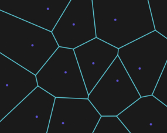
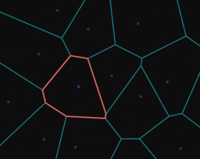
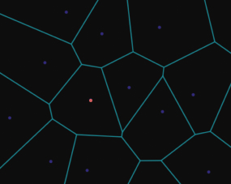
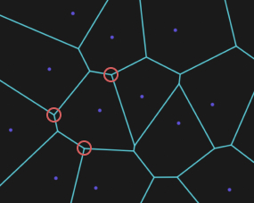

_Алгоритм Форчуна_  
_Реализовал студент Дывак М.В._  
_Дальневосточный Федеральный Университет_  
_Б9121-09.03.03пикд_  
_2022_

# Содержание
* Содержание
* Глоссарий
* Введение
* Теория
    * Заметающая прямая
    * Локус
    * Сайт
    * Свойство диаграммы Вороного
* Реализация
* История
* Применение
    * В программировании, разработке игр и картографии
    * В архитектуре и дизайне
    * В археологии
    * В моделировании и распознавании
    * В биологии и химии
* Список литературы

# Глоссарий
>- Вершины диаграммы Вороного — вершины многоугольников, ограничивающих локусы.
>- Выпуклый многоугольник — это многоугольник, у которого продолжения сторон не пересекают других его сторон.
>- Евклидово пространство — это пространство, свойства которого описываются аксиомами евклидовой геометрии.
>- Локус — область, в которой присутствуют все точки, которые находятся ближе к данной точке, чем ко всем остальным. В диаграмме Вороного локусы являются выпуклыми многоугольниками.
>- Метрика Евклида — расстояние между двумя точками евклидова пространства, вычисляемое по теореме Пифагора.
>- Невыпуклый многоугольник — это многоугольник, в котором найдутся такие две вершины, что через них проводится прямая, пересекающая данный многоугольник где-либо ещё, кроме ребра, соединяющего эти вершины.
>- Простой многоугольник — это многоугольник без самопересечений. Мы будем рассматривать только простые многоугольники.
>- Ребра диаграммы Вороного — стороны многоугольников, ограничивающих локусы, но при этом не являющимися их частью.
>- Сайт (_англ. site_) — точка, для которой строится локус.

# Введение
> Диаграмма Вороного – множество точек на плоскости, которые разбивают эту плоскость, на которой каждая область этого разбиения образует множество точек, более близких к одному из элементов множества, чем к любому другому элементу множества. Именно из выпуклых многоугольников и будет состоять диаграмма.  

Алгоритм Форчуна берёт множество 2D-точек и строит из них диаграмму Вороного.

# Теория

## Заметающая прямая
По плоскости движется заметающая прямая (_англ. sweepline_). Движется скачками — от точки к точке. 

Первая часть этих точек — это точки со ввода, которые становятся сайтами.  
Вторая часть — это "виртуальные" точки, крайние по ходу движения заметающей прямой точки описанных окружностей. 

При движении (параллельном переносе) заметающей прямой она касается любой такой описанной окружности дважды — второй раз эквивалентен событию, при котором диаграмма Вороного достраивается: к ней добавляется вершина, одно или более рёбер оканчиваются этой новой вершиной и одно или два новых ребра выходят из неё.

## Локус
Для некоторого конечного набора попарно различных точек на плоскости (далее N — количество точек) диаграмма Вороного представляет из себя разбиение плоскости на локусы.  

## Сайт
Каждый локус содержит в себе сайт диаграммы Вороного.

Для обычного определения расстояния на плоскости — метрики Евклида — форма локусов в общем случае является выпуклым многоугольником. Конечно же существуют крайние случаи, как если в исходном множестве 1 (локус — вся плоскость), 2 точки (локус — полуплоскость), либо точки (N > 2) находящиеся на одной прямой (в этом случае внутренними локусами будут полосы, а внешними — полуплоскости). 

Крайние, из множества ячеек в общем случае, являются частью выпуклых многоугольников с двумя сторонами, уходящими в бесконечность, то есть параллельными, либо расходящимися лучами. Ребра диаграммы Вороного могут быть отрезками, лучами, либо прямыми. Каждое ребро — это множество точек, равноудалённых ровно от двух сайтов, то есть лежит на серединном перпендикуляре для двух сайтов. 

Вершины диаграммы Вороного являются точками, равноудалёнными от трёх и более сайтов, то есть являются центрами описанных окружностей многоугольников, которые можно было бы построить на сайтах примыкающих ячеек, как на вершинах.

## Свойство диаграммы Вороного
Каждая вершина диаграммы Вороного является точкой пересечения в точности трех ребер диаграммы  

# Реализация
Алгоритм написан на JavaScript. HTML файл является конструктором визуализатора алгоритма. В HTML-элементе "canvas" рисуются диаграммы. Данная реализация состоит исключительно из классов с использованием классических массивов, поэтому асимптотическая временная сложность O(n²), вместо O(n•log(n)), как это реализовано в алгоритмах с использованием очереди.

# История
Алгоритм первоначально опубликовал Стивен Форчун в 1986 в своей статье «Алгоритм заметающей прямой для диаграмм Вороного».

Первое использование диаграммы Вороного встречается в труде Рене Декарта (1596-1650) «Начала философии» (1644). Декарт предложил деление Вселенной на зоны гравитационного влияния звезд. Только спустя два века, известный немецкий математик Иоганн Петер Густав Лежён-Дирихле (1805 — 1859) ввел диаграммы для двух- и трехмерного случаев. Поэтому их иногда называют диаграммами Дирихле. 

В 1908 году русский математик Георгий Феодосьевич Вороной (16(28) апреля 1868 — 7(20) ноября 1908) описал эту диаграмму для пространств бОльших размерностей, с тех пор диаграмма носит его фамилию. Вот его краткая биография:

Георгий Феодосьевич Вороной родился в деревне Журавка Полтавской губернии (ныне Черниговская область). С 1889 года обучался в Санкт-Петербургском университете у Андрея Маркова. В 1894 году защитил магистерскую диссертацию «О целых числах, зависящих от корня уравнения третьей степени». В том же году был избран профессором Варшавского университета, где изучал цепные дроби. У Вороного обучался Вацлав Серпинский. 

В 1897 году Вороной защитил докторскую диссертацию «Об одном обобщении алгоритма непрерывных дробей», удостоенную премии имени Буняковского. 

# Применение
## В программировании, разработке игр и картографии
В вычислительной геометрии диаграмма Вороного нужна прежде всего для решения задачи близости точек, а точнее, особый выигрыш диаграмма даёт в решении задачи ВСЕ ближайшие соседи

## В архитектуре и дизайне
Весьма логично, что людям в голову пришла идея использовать диаграмму Вороного в архитектуре и дизайне, поскольку она сама по себе является красивым рисунком, своего рода «геометрической паутиной», так что есть много случаев применения её в качестве одного из основных элементов композиции или даже каркаса всего творения.

## В археологии
В археологии многоугольники Вороного используются для нанесения на карту ареала применения орудия труда в древних культурах и для изучения влияния соперничающих центров торговли.

В экологии возможности организма на выживание зависят от числа соседей, с которыми он должен бороться за пищу и свет — что вполне логично, ведь обычно за любое «выживание» бьются именно соседствующие регионы.

## В моделировании и распознавании
Диаграмма Вороного имеет многие приложения в физике и 3D-моделировании объектов. Разного рода сетки (и скелеты) объектов в пространстве можно построить с помощью диаграммы Вороного (однако чаще с помощью триангуляции Делоне). 

## В биологии и химии
Совместное влияние электрических и близкодействующих сил, для изучения которых строятся сложные диаграммы Вороного, помогает определять структуру молекул.

# Список литературы
[Алгоритм Форчуна для построения диаграммы Вороного на плоскости — Хабр](https://ru.wikipedia.org/wiki/Алгоритм_Форчуна)  
[Алгоритм Форчуна — Википедия](https://habr.com/ru/post/315658/)  
[Диаграмма Вороного — ИТМО](https://neerc.ifmo.ru/wiki/index.php?title=Диаграмма_Вороного)  
[Описание алгоритма Форчуна — Nina.az](https://www.wiki-data.ru-ru.nina.az/Алгоритм_Форчуна.html)  
[What's a Voronoi Diagram? — CodeForces](https://codeforces.com/blog/entry/85638)